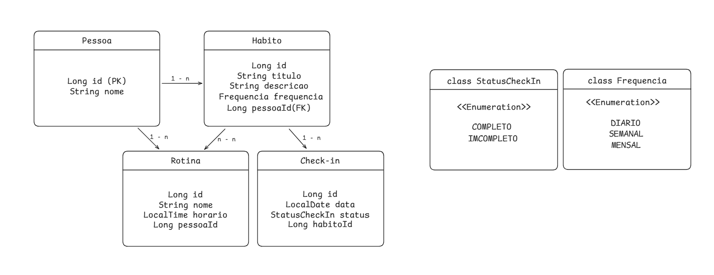
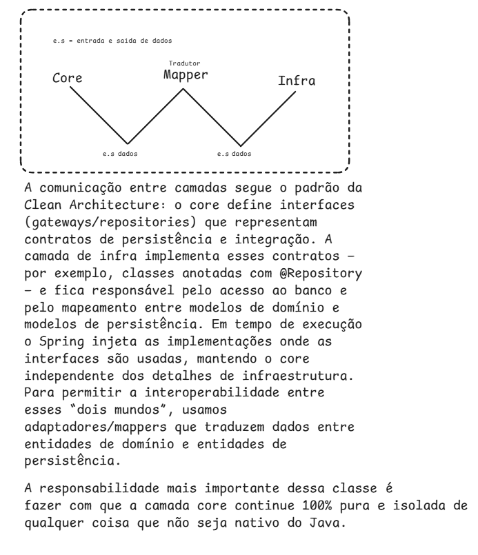

# HABITRACK - EM DESENVOLVIMENTO

---


<p align="center">
  <a href="https://skillicons.dev">
    
  </a>
</p>

## OBJETIVO DO PROJETO:

Este projeto adota a Clean Architecture para separar claramente as regras de negócio (core) dos detalhes de infraestrutura — frameworks, banco de dados e camada web. O fluxo de dependências é estritamente unidirecional e aponta sempre para o core, garantindo baixo acoplamento, testabilidade e facilidade de evolução.

---

## AS FUNCIONALIDADES ATUALMENTE SÃO:
* `Criar um novo hábito para uma pessoa existente.`
* `Listar todos os hábitos de uma pessoa específica.`

---



---



---

## Criar um Novo Hábito

* `Endpoint: POST /api/habitos`
* `Descrição: Cria um novo hábito associado a uma pessoa.`
* `Corpo da Requisição (JSON):`
    ```json
    {
        "pessoaId": 1,
        "titulo": "Ler 20 páginas de um livro",
        "descricao": "Foco no livro de Clean Architecture",
        "frequencia": "DIARIO"
    }
    ```
* `Resposta de Sucesso (201 Created):`
    ```json
    {
        "habito": {
            "id": 101,
            "titulo": "Ler 20 páginas de um livro",
            "descricao": "Foco no livro de Clean Architecture",
            "frequencia": "DIARIO",
            "pessoaId": 1
        }
    }
    ```
---

## Listar Hábitos de uma Pessoa

* `Endpoint: GET /api/habitos/por-pessoa/{pessoaId}`
* `Descrição: Retorna uma lista com todos os hábitos de uma pessoa específica`
* `Parâmetro de URL:`
    * `pessoaId (Long): O ID da pessoa cujos hábitos serão listados.`
* `*Resposta de Sucesso (200 OK):`
    ```json
    {
        "habitos": [
            {
                "id": 101,
                "titulo": "Ler 20 páginas de um livro",
                "descricao": "Foco no livro de Clean Architecture",
                "frequencia": "DIARIO",
                "pessoaId": 1
            },
            {
                "id": 102,
                "titulo": "Ir à academia",
                "descricao": "Treino de peito e ombro",
                "frequencia": "SEMANAL",
                "pessoaId": 1
            }
        ]
    }
    ```
projeto desenvolvido por: Thiago Monteiro